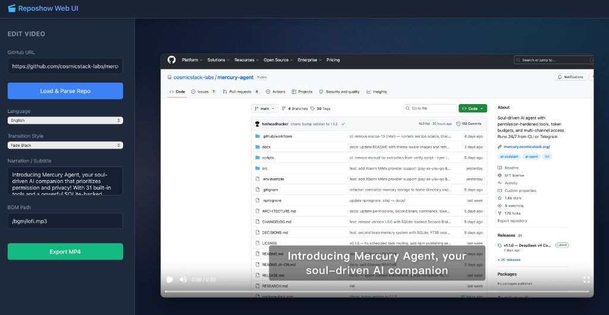

# 🎬 GitHub Video Generator

[English](README.md) | **简体中文**

一条命令为任意 GitHub 仓库自动生成介绍视频：自动截图、AI 旁白、字幕同步、Remotion 渲染。

## Web UI

左侧：仓库 URL、语言、转场、旁白文案、**Load & Parse Repo**、**Export MP4**。右侧：带字幕的 Remotion 预览（`http://localhost:5173`）。



## ✨ 功能

- **一条命令生成** — 传入 GitHub 仓库 URL 即可
- **自动截图** — 通过 Playwright 截取仓库页、Star 数、README
- **AI 旁白文案** — 使用 GPT（`gpt-4o-mini`）生成旁白脚本
- **多供应商 TTS** — Gemini Flash TTS（多说话人）；中文失败时回退 DashScope；英文失败时回退 OpenAI TTS
- **智能字幕** — Whisper 转写 + 与参考文本对齐，时间轴更准
- **场景转场** — 色差、模糊、缩放、溶解、滑动等
- **中英文** — 旁白与字幕均支持中英
- **Remotion 渲染** — 高质量 MP4，含缩放动画与音效

## 📋 环境要求

- **Python** 3.11+
- **Node.js** 18+
- **ffmpeg**（须在 `PATH` 中；用于 PCM→MP3 与字幕时间）
- **Playwright 浏览器** — 执行 `pip install -r requirements.txt` 后运行 `playwright install chromium`（或 `playwright install` 安装全部浏览器）

### API Key（实际需要哪些）

| 用途 | 推荐配置的 Key |
|---|---|
| **网页 UI + 旁白 + 字幕** | `GEMINI_API_KEY`、`OPENAI_API_KEY` |
| **仅 CLI、最少配置** | 至少一个可用的 TTS Key — 通常为 `GEMINI_API_KEY`；Gemini 失败时中文可用 `DASHSCOPE_API_KEY` 作为回退 |

完整说明见下文 **API Keys** 小节。

## 🚀 快速开始

### 1. 克隆与安装

```bash
git clone https://github.com/YOUR_USERNAME/reposhow.git
cd reposhow

# Python 依赖
pip install -r requirements.txt
python -m playwright install chromium

# Node 依赖（Remotion + Vite 前端）
npm install
```

### 2. 配置环境变量

FastAPI 服务（`server.py`）读取 **`./.env.local`**（不是 `.env`）。推荐：

```bash
cp .env.example .env.local
# 编辑 .env.local，填入你的 Key
```

也可以在启动 Python 前在 shell 中导出：

```bash
export GEMINI_API_KEY="your-gemini-api-key"
export OPENAI_API_KEY="your-openai-api-key"
export DASHSCOPE_API_KEY="your-dashscope-api-key"
```

### 3A. 网页界面（浏览器预览）

需要 **两个终端** — Vite 将 `/api` 与 `/out` 代理到后端（`vite.config.ts` → `http://localhost:8000`）。

**终端 1 — 后端**

```bash
python server.py
```

监听：`http://127.0.0.1:8000`（OpenAPI 文档：`/docs`）。

**终端 2 — 前端**

```bash
npm run web
```

浏览器打开 **`http://localhost:5173`**，粘贴 GitHub 仓库 URL，选择语言后点击 **Load & Parse Repo**。完成后可用 **Export MP4**。预览初始为空，生成后才有画面（界面未内置默认仓库）。

若浏览器出现 `/api/generate` 的 `http proxy error` / `ECONNREFUSED`，说明 **8000** 端口后端未启动 — 请先启动终端 1。

### 3B. CLI — 生成视频文件

```bash
python reposhow.py https://github.com/facebook/react
```

输出：`out/react.mp4`

## 📖 用法

### CLI — 基础

```bash
# 默认设置生成（中文旁白）
python reposhow.py https://github.com/user/repo

# 英文旁白
python reposhow.py https://github.com/user/repo --lang en

# 自定义输出路径
python reposhow.py https://github.com/user/repo --output my_video.mp4

# 干跑（只打印参数，不渲染）
python reposhow.py https://github.com/user/repo --dry-run
```

### CLI — 进阶

```bash
# 自定义旁白全文
python reposhow.py https://github.com/user/repo \
  --narration-text "This amazing project..."

# 自定义滚动
python reposhow.py https://github.com/user/repo \
  --scroll-distance 3000 --scroll-duration 30

# 切换转场风格
python reposhow.py https://github.com/user/repo \
  --transition blur

# 无音频
python reposhow.py https://github.com/user/repo --no-audio
```

### 多说话人旁白

在旁白文本中使用 `Speaker N:` 标记可启用多说话人 TTS（仅 Gemini）：

```bash
python reposhow.py https://github.com/user/repo \
  --narration-text "Speaker 1: Welcome to this project!\nSpeaker 2: Let's dive into the details."
```

## ⚙️ CLI 参数说明

| 参数 | 默认值 | 说明 |
|---|---|---|
| `url` | （必填） | GitHub 仓库 URL |
| `--output` | `out/{slug}.mp4` | 输出视频路径 |
| `--lang` | `zh` | 语言：`zh` 或 `en` |
| `--dry-run` | — | 只打印参数，不渲染 |
| `--scroll-distance` | `2500` | 第 3 幕滚动像素 |
| `--scroll-duration` | `25` | 第 3 幕时长（秒） |
| `--bgm` | `/bgm/lofi.mp3` | 背景音乐路径 |
| `--zoom-sfx` | `/sfx/1.wav` | 缩放音效 |
| `--sfx` | `/sfx/2.wav` | 下划线音效 |
| `--no-audio` | — | 关闭所有音频 |
| `--no-narration` | — | 跳过 TTS 旁白 |
| `--narration-text` | （自动） | 自定义旁白脚本 |
| `--subtitle-text` | （自动） | 自定义字幕文本 |
| `--transition` | `chromatic` | 转场风格 |

**转场风格：** `none`、`black`、`white`、`chromatic`、`blur`、`zoom`、`dissolve`、`slide`

## 🎬 视频结构

| 时间 | 场景 | 效果 |
|---|---|---|
| 0–4s | 仓库主页 | 慢速缩放 + 仓库名下划线 |
| 4–8s | Star/Fork | 聚焦缩放 + Star 数下划线 |
| 8s+ | 整页滚动 | 随旁白平滑滚动 README |

## 🔑 API Keys

| 服务商 | 环境变量 | 用途 |
|---|---|---|
| **Gemini** | `GEMINI_API_KEY` | TTS（`zh` / `en` 首选；旁白含 `Speaker N:` 行时为多说话人） |
| **OpenAI** | `OPENAI_API_KEY` | GPT 旁白脚本、Whisper 字幕对齐、**英文** Gemini 失败时的 TTS 回退 |
| **DashScope** | `DASHSCOPE_API_KEY` | **中文** Gemini 失败时的 TTS 回退 |

**TTS 顺序（当前逻辑）**

1. 若配置了 `GEMINI_API_KEY`，先尝试 **Gemini**。
2. Gemini 失败：**`en`** → OpenAI TTS（需 `OPENAI_API_KEY`）；**`zh`** → DashScope（需 `DASHSCOPE_API_KEY`）。
3. 若仍无可用 TTS，则跳过旁白音频（界面仍可能显示脚本/字幕，取决于流水线）。

**脚本生成：** 未配置 `OPENAI_API_KEY` 时，旁白文案会回退到内置模板，而非 GPT。

## ❓ 常见问题

| 现象 | 处理 |
|---|---|
| `BrowserType.launch: Executable doesn't exist` / 提示执行 `playwright install` | 运行 `python -m playwright install chromium`（与运行 `server.py` / `reposhow.py` **同一** Python 环境）。安装后重启后端。 |
| Vite 报 `/api/generate` 的 `http proxy error` / `ECONNREFUSED` | 先启动 **`python server.py`**；Vite 只代理到 `localhost:8000`。 |
| `pip install requirements.txt` 失败 | 使用 **`pip install -r requirements.txt`**（`-r` 表示从文件读取依赖）。 |

## 🏗️ 技术栈

- **[Remotion](https://remotion.dev/)** — 基于 React 的视频渲染
- **[Playwright](https://playwright.dev/)** — 浏览器自动化截图
- **Gemini Flash TTS** — Google 多说话人语音合成
- **DashScope CosyVoice** — 阿里多语言 TTS
- **OpenAI Whisper** — 音频转写，用于字幕对齐

## 📄 许可证

[MIT](LICENSE)
